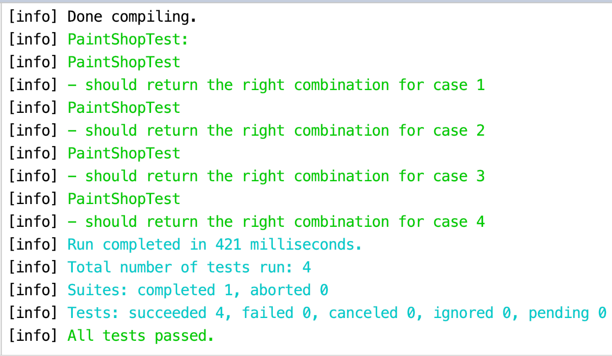

# paint-shop

Use brute force to get all combinations of different paint colors, 
and then find combinations satisfying all customers' preference. 
For multiple satisfied combinations, sort them in least Matte order 
because Matte paints are expensive.

Test cases can be found [here](./src/test/scala/PaintShopTest.scala)

